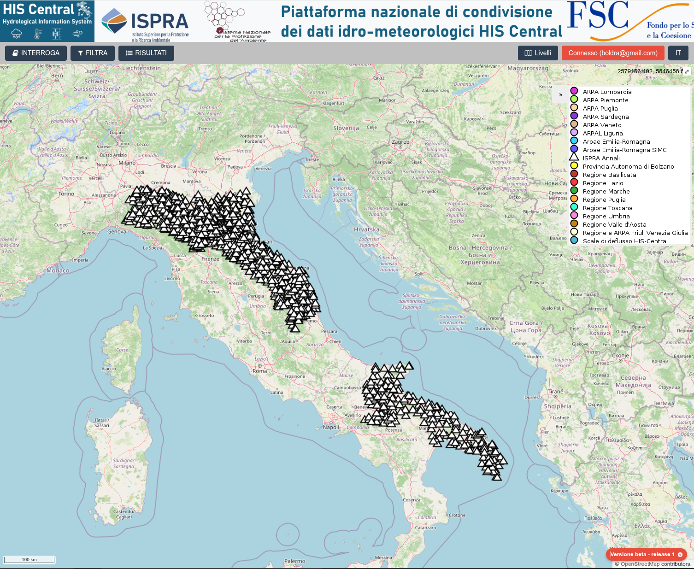

# Italian Hydrological Annals Interoperable Dataset

## Overview

This repository contains the digitized and quality-controlled database of the historical **Italian Hydrological Annals** (*Annali Idrologici Italiani*), together with the Docker-based infrastructure required to publish the data through **HydroServer** and **FROST Server**.

The database was produced by digitizing the original printed volumes of the *Annali Idrologici Italiani* and performing quality control procedures prior to publication.

The repository enables publication of the database through FROST server and HydroServer, providing standardized and interoperable access to historical hydrological observations, paving the way for integration of this dataset into data sharing initiatives such as HIS-Central.

A linked Zenodo publication is made available, for enabling data preservation and open-science according to FAIR principles.

A scientific publication is under preparation to document this work.



## Quickstart

The repository has compressed Annals data under `data/`, while generated processed data is written to `data/processed/`; mapped STA JSON for FROST is written to `data/processed/sta/`. These folders are not committed to Git.

### Bring your own FROST (single container)

If you already run a FROST Server, you can download the Annals data from GitHub, prepare it, map it to SensorThings, and upload it with one command. Build the image from this repository (or pull it from Docker Hub once published):

```bash
docker build -t isprabioacas/annals-frost-ingestor:latest ./ingestor-frost

docker run --rm \
  -e FROST_BASE_URL=https://my-frost.example.com/FROST-Server/v1.1/ \
  -e ANNALS_MAX_OBSERVATIONS_PER_BATCH=1000 \
  -e ANNALS_UPLOAD_PARALLELISM=16 \
  -v annals-data:/data \
  isprabioacas/annals-frost-ingestor:latest
```

- `FROST_BASE_URL` – full SensorThings root of your FROST instance (must include `/FROST-Server/v1.1/`)
- `ANNALS_MAX_OBSERVATIONS_PER_BATCH` – observations per `$batch` upload (default `1000`)
- `ANNALS_UPLOAD_PARALLELISM` – concurrent datastream upload threads (default `16`)
- Optional volume `annals-data` caches downloaded/prepared data across runs

Smoke test with a small subset: add `-e ANNALS_FAST=true`. To pin a dataset revision: `-e ANNALS_DATA_REF=v1.0.0`. To use a Zenodo/GitHub release archive instead of a git sparse clone: `-e ANNALS_DATA_URL=https://...`.

Local multi-step compose workflows below are unchanged (prepare, FROST stack, frost/HydroServer ingestors).

### Data preparation (shared by both HydroServer and FROST server)

Both publication targets use the same prepared CSV files under `data/processed/` (ZIP extraction and sorted `OSSERVAZIONI` files). FROST additionally needs the mapped STA folder at `data/processed/sta/`. HydroServer reads the prepared CSVs directly and does not use the STA folder. Run the following command to prepare the data (it will unzip, sort and map to STA).

```bash
docker compose -f docker-compose-annals-prepare.yml up --build
```

Then you are ready to publish with Docker:

### FROST Server

```bash
# 1. Start FROST Server and PostGIS (keep running) - note: this is a demo configuration, refer to FROST server documentation for production deployment.
docker compose -f docker-compose-frost.yml up -d

# 2. Upload mapped STA data to FROST (run prepare step first if needed)
docker compose -f docker-compose-annals-frost-ingestor.yml up --build
```

The FROST ingestor uploads `data/processed/sta/` to FROST on port **8082**. The FROST API is available at `http://localhost:8082/FROST-Server/v1.1/`.

To reset the database and start fresh:

```bash
docker compose -f docker-compose-frost.yml down -v
docker compose -f docker-compose-frost.yml up -d
```

### HydroServer

```bash
# 1. Start HydroServer and PostgreSQL (keep running)  - note: this is a demo configuration, refer to HydroServer documentation for production deployment.
docker compose -f docker-compose-hydroserver.yml up -d

# 2. Create the admin user with credentials matching docker-compose-annals-hs-ingestor.yml
#    by visiting http://localhost:8000/

# 3. Upload prepared CSV data into HydroServer (run prepare step first if needed)
docker compose -f docker-compose-annals-hs-ingestor.yml up --build
```

HydroServer is available at `http://localhost:8000/`.

To reset the database and start fresh:

```bash
docker compose -f docker-compose-hydroserver.yml down -v
docker compose -f docker-compose-hydroserver.yml up -d
```

## Repository Contents

The repository includes:

- the quality-controlled database dump of the digitized *Annali Idrologici Italiani* (`data/`, CC BY 4.0);
- ingestor and publication software (`ingestor-frost/`, `ingestor-hydroserver/`, AGPL-3.0);
- Docker configuration for deploying HydroServer and FROST Server;
- configuration files and documentation required to publish the dataset.

## Citation

Each GitHub release is automatically archived by **Zenodo** and assigned a persistent DOI. Please cite as well the publication describing this work (more information will be here available, currently under prepraration).

### Dataset (ISPRA BIO-ACAS)

When you use the **hydrological data** under `data/`, cite the dataset. Metadata is in [`CITATION.cff`](CITATION.cff) (`type: dataset`, author: **ISPRA BIO-ACAS**, license: CC BY 4.0). The CNR-ITIAm software author is listed there as a **contributor** so they also appear on the linked **Zenodo** publication.

- cite the **version DOI** corresponding to the specific release used in your work;
- cite the **concept DOI** when referring to the dataset as a whole.

GitHub's "Cite this repository" button uses `CITATION.cff` and refers to the **dataset**.

### Software (CNR-ITIAm / ESSI-Lab)

When you use or redistribute the **ingestor software** (`ingestor-frost/`, `ingestor-hydroserver/`), acknowledge:

**National Research Council of Italy (CNR) / Institute of Technologies and Environmental Intelligence (ITIAm) / ESSI-Lab**

Software citation metadata is in [`CITATION-software.cff`](CITATION-software.cff) (`type: software`, license: AGPL-3.0). Copyright notices are also in the source file headers.

## License

This repository uses **two licenses**, depending on what you use:

| Content | Path | License |
|---------|------|---------|
| **Dataset** (Annals CSV/ZIP files and reference tables) | `data/` | [Creative Commons Attribution 4.0 International (CC BY 4.0)](LICENSE) |
| **Software** (ingestors, FROST client, Docker tooling) | `ingestor-frost/`, `ingestor-hydroserver/` | [GNU Affero General Public License v3.0 (AGPL-3.0)](SOFTWARE-LICENSE) |

- The full CC BY 4.0 legal text is in the repository root [`LICENSE`](LICENSE) file and applies to the hydrological **data** under `data/`.
- **Source code** is licensed under AGPL-3.0; copyright and license notices are in the file headers (see `ingestor-frost/license/AGPL-3-header.txt` and `ingestor-hydroserver/license/AGPL-3-header.txt`).
- Generated outputs under `data/processed/` are derived from the dataset and ingestor tooling; treat them as dataset derivatives when redistributing the Annals data.

When citing or redistributing, follow the license that applies to the part you use (data vs. software).

## Acknowledgements

The digitization, quality control, and publication of the *Italian Hydrological Annnals Interoperable Dataset* have been carried out by **ISPRA BIO-ACAS**, with the contribution of the repository contributors listed in the citation metadata.
